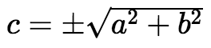
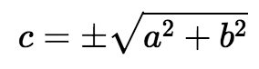

# katex-elements
Web Components for easily using [KaTeX][katex] in HTML

[katex]: https://github.com/Khan/KaTeX

## Installation

```bash
> npm i katex-elements
```

## Usage

### 1. Import the elements

#### From HTML:

Import all the elements:
```html
<script type="module" src="./node_modules/katex-elements/index.js"></script>
```

Import each element individually:

```html
<script type="module" src="./node_modules/katex-elements/katex-expr.js"></script>
<script type="module" src="./node_modules/katex-elements/katex-display.js"></script>
<script type="module" src="./node_modules/katex-elements/katex-inline.js"></script>
```
> _Note: the path to the JavaScript modules may depend on your npm installation_

#### From JavaScript:

Import all the elements:
```js
import {KatexDisplay} from 'katex-elements';
```

Import each element individually:
```js
import {KatexDisplay} from 'katex-elements/katex-expr.js';
import {KatexDisplay} from 'katex-elements/katex-display.js';
import {KatexInline} from 'katex-elements/katex-inline.js';
```

Note that this package uses "bare module specifiers" to import the `katex` package. You will need a server or bundler that resolves these specifiers to URLs that will work in a browser, such as Rollup or [`@web/dev-server`](https://modern-web.dev/docs/dev-server/overview/).

### 2. Use the elements

## &lt;katex-inline&gt;

Renders its text content in inline mode.

### markup:

```html
<katex-inline>c = \pm\sqrt{a^2 + b^2}</katex-inline>
```

### output:


## &lt;katex-display&gt;

Renders its text content in display mode, which will put the math in display style (so `\int` and `\sum` are large, for example), and will center the math in a block element.

### markup:

```html
<katex-display>c = \pm\sqrt{a^2 + b^2}</katex-display>
```

### output:


## &lt;katex-expr&gt;

`<katex-expr>` is the base class for `<katex-inline>` and `<katex-display>`. It renders inline or display based on the `display-mode` attribute.

```html
<katex-expr display-mode>c = \pm\sqrt{a^2 + b^2}</katex-expr>
```
